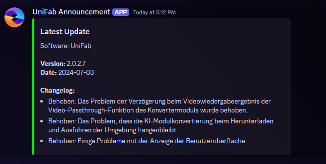
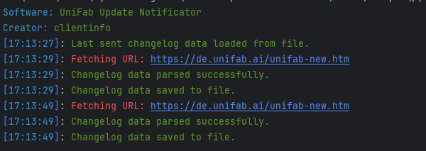

# UniFab Changelog Watcher

## Overview

The **UniFab Changelog Watcher** is a Python-based tool designed to watch UniFab for updates, parse the changelogs and send them to a Discord webhook.

## Installation

1. **Clone the repository**:
    ```sh
    git clone https://github.com/yourusername/unifab-changelog-watcher.git
    cd unifab-changelog-watcher
    ```

2. **Install dependencies**:
    ```sh
    pip install -r requirements.txt
    ```

## Usage

1. **Configure the script**:
   - Update the `URL` and `WEBHOOK_URL` variables in `changelog_watcher.py` with the actual URLs.

2. **Run the script** (Note: to close the program press ctrl + c):
    ```sh
    python main.py
    ```

## Modules

### changelog_watcher

This module implements the `UniFabChangelogWatcher` class, which monitors the update page of UniFab, parses the update changelog and sends the data to a Discord webhook.

### discord_notifier

This Module has the class `DiscordNotifier` which formats and sends the data to a specified Discord channel.

### changelog_parser

This module handles fetching, parsing, saving, and loading changelog data from HTML and JSON files. The `ChangelogParser` class uses `requests` for fetching HTML content and `BeautifulSoup` for parsing it.

### console_color

This module defines the `Color` class that provides ANSI escape sequences for color formatting in terminal outputs.

## Screenshots

### Discord embed of the changelog:


### Screenshot of the running python app
